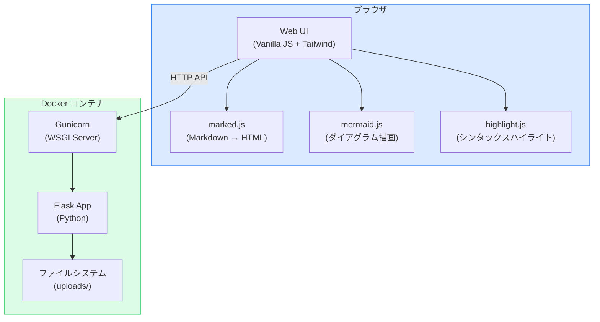
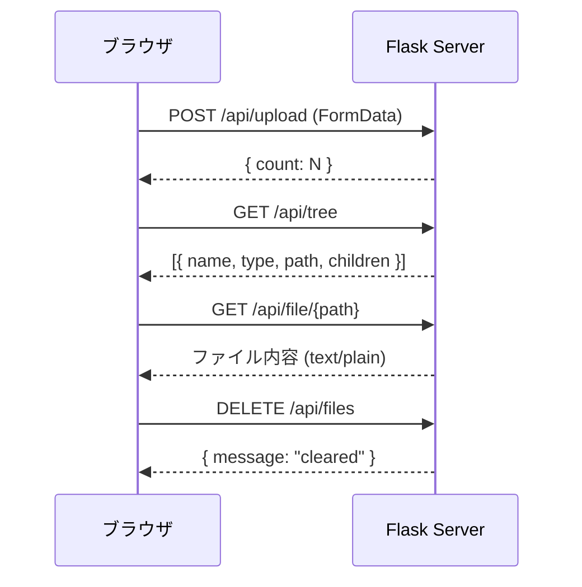
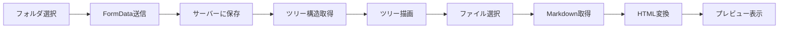
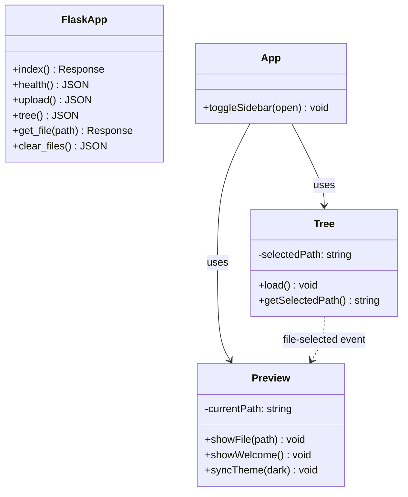

# アーキテクチャ概要

## システム構成図

## API 設計

## データフロー

## 技術スタック

### フロントエンド
- **Vanilla JavaScript** – フレームワークなし、軽量
- **Tailwind CSS** (CDN) – ユーティリティファーストCSS
- **marked.js** – Markdown → HTML変換
- **mermaid.js** – ダイアグラム描画
- **highlight.js** – コードハイライト

### バックエンド
- **Python 3.12** – ランタイム
- **Flask 3.x** – Webフレームワーク
- **Gunicorn** – 本番WSGIサーバー
- **Docker** – コンテナ化

## クラス図（例）

